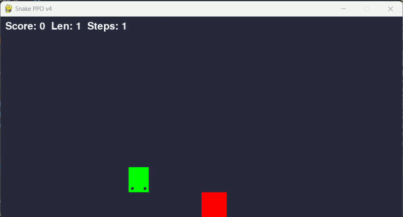
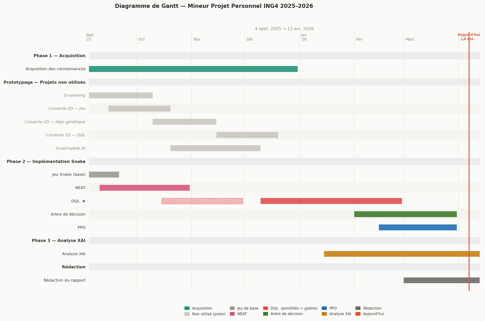

# 🐍 Snake AI Using Proximal Policy Optimization (PPO)


<p align="center">
  
</p>

## 📝 Project Description

This project is a **continuation** of my Snake AI series :

- 🎮 The Snake game itself : [snake_game](https://github.com/Thibault-GAREL/snake_game)
- 🧬 First AI version using NEAT (NeuroEvolution) : [AI_snake_genetic_version](https://github.com/Thibault-GAREL/AI_snake_genetic_version)
- 🌳 Second AI version using Decision Trees : [AI_snake_decision_tree_version](https://github.com/Thibault-GAREL/AI_snake_decision_tree_version)
- 🤖 Third AI version using DQN : [AI_snake_DQN_version](https://github.com/Thibault-GAREL/AI_snake_DQN_version)

This time, the agent learns to play Snake using **Proximal Policy Optimization (PPO)** with PyTorch and CUDA support. Unlike DQN which learns Q-values off-policy from a replay buffer, PPO is an **on-policy actor-critic** algorithm : it separates two distinct roles — an **Actor** that directly learns a probability distribution over actions, and a **Critic** that learns a state-value function V(s) used only to guide the Actor. Updates are stabilized by a **clipped surrogate objective** that prevents destructive policy changes. PPO achieves the best results of the entire series with a mean score of **38.67 apples** and a maximum of **64** 🎯

The project also includes a full **Explainable AI (XAI)** suite adapted for the actor-critic architecture, analyzing what the network has learned beyond raw performance metrics.

---

## 🔬 Research Question

> **How do we extract complex reasoning from a neural network?**

Neural networks are often described as **black boxes**: their internal decision logic remains opaque despite producing relevant results. This project goes beyond training a performant agent — it applies **Explainable AI (XAI)** techniques to understand *why* the network makes the decisions it does.

PPO is architecturally the most complex model in this series: a shared trunk feeding two independent heads, one producing action probabilities, the other estimating state value. XAI tools — SHAP, permutation importance, saturation analysis, UMAP projections — reveal what the two heads independently learned, and most critically, **that the PPO agent developed a finer and more symmetric sensitivity to danger** than any of the previous experiments.

---

## 🎯 Context & Motivation

The deeper motivation behind this project series is the **alignment problem** — one of the most important open challenges in AI. It refers to the difficulty of ensuring that AI systems act in accordance with human intentions, not just formal instructions.

Concrete failures: an agent tasked with "maximizing cleanliness" might throw away useful objects (emergent objectives), hide dirt (reward hacking), or block humans from entering. The agent does exactly what it was told — not what was intended.

This gap is hard to diagnose when you can't see inside the model. One key obstacle is the **black box problem**: deep neural networks make decisions through immense parameter spaces whose internal logic is effectively unreadable to humans. **Explainable AI (XAI)** is one answer — making AI reasoning transparent and interpretable.

PPO is the culmination of this series: the highest-performing agent, the richest internal representation, and the clearest evidence of a qualitatively different strategy compared to NEAT, the Decision Tree, and DQL.

---

## 🩻 Interpretability Spectrum

A key conceptual framework underlying the whole project series:

| Box type | Definition | Example |
| -------- | ---------- | ------- |
| ⬜ White box | Fully readable logic — policy extractable directly | Q-table (tabular Q-learning) |
| 🟨 Grey box | Transparent structure, unreadable complexity | XGBoost (80k–200k nodes) |
| ⬛ Black box | Opaque internals despite good performance | **PPO (this project)** |
| 🟩 NEAT | Small enough for manual inspection + XAI | NEAT (16 inputs, evolved topology) |

PPO is a black box by nature: its policy is a non-linear combination of two shared layers followed by an actor head — no human can read the learned strategy from weights alone. The Actor–Critic split adds a layer of interpretability that DQL lacks (we can now ask *"how does the Critic evaluate this position independently of the action chosen?"*), but **XAI tools remain the only way to understand what was actually learned**.

---

## 🚀 Features

  🧠 **Actor-Critic architecture** — shared trunk with separate policy and value heads

  ⚡ **CUDA support** — automatic GPU detection and training

  📐 **Generalized Advantage Estimation (GAE)** — λ=0.95 for stable advantage computation

  ✂️ **PPO Clipping** — ε=0.15 for conservative policy updates

  🔄 **CosineAnnealing LR** — smooth decay from 3e-4 to 1e-5 over full training

  💾 **Auto-save** — best model checkpoint based on 50-episode rolling mean score

  📊 **CSV training log** — episode, score, entropy, LR, losses tracked every episode

  🔬 **Full XAI suite** — 4 independent analysis scripts adapted for actor-critic

  📐 **Unified 28-feature state** — shared across all 4 Snake AI projects (see [input.md](input.md))

---

## ⚙️ How it works

  🕹️ The AI controls a snake on a **16×8 grid** (800×400 px). At each step, it receives a **state vector of 28 features** and outputs **policy logits for 4 actions** (UP, RIGHT, DOWN, LEFT) along with a **state value estimate V(s)**. Unlike DQL where outputs are unbounded Q-values, PPO outputs are **probabilities** (via softmax on the actor logits).

  🧠 **Phase 1 — Rollout collection** : `N_ENVS=8` parallel environments each collect `N_STEPS=1024` transitions, producing 8 192 steps per update. The Critic evaluates every state to compute GAE advantages.

  📐 **Phase 2 — Advantage estimation** : Generalized Advantage Estimation (GAE, λ=0.95) smooths the temporal credit assignment, balancing bias vs. variance better than raw TD errors. This is a key reason PPO outperforms DQL on long-horizon episodes.

  🎯 **Phase 3 — PPO update** : 10 epochs over mini-batches of 256 transitions. The surrogate objective clips the policy ratio `r(θ) = π(a|s) / π_old(a|s)` to `[1−ε, 1+ε]` with ε=0.15, preventing large updates. An entropy bonus (coef=0.05) encourages continued exploration — critical for the snake to learn to navigate its own long body.

  🎁 The reward shaping guides the agent with a survival bonus (+0.02/step), a **potential-based proximity reward** (proportional to the reduction in Manhattan distance to food), a food reward (+10), a death penalty (−10 − length×0.5), and an adaptive stagnation penalty (−0.5 if steps without food > max(100, 300−length×5)).

  ⏱️ A **MAX_STEPS=1000** episode limit allows long enough episodes for the snake to realistically reach scores of 23+.

---

## 🗺️ Network Architecture

```
Input (28)
    │
    ├─ Linear(28 → 256) ─ LayerNorm ─ Tanh   ┐
    └─ Linear(256 → 256) ─ LayerNorm ─ Tanh  ┘ Shared trunk
              │                    │
    ┌─────────┘                    └──────────┐
    │ Actor head                   Critic head │
    │ Linear(256 → 128) ─ Tanh                │ Linear(256 → 128) ─ Tanh
    │ Linear(128 → 4)                         │ Linear(128 → 1)
    ↓                                         ↓
  Policy logits [4]                      State value [1]
  → softmax → P(action)                  → V(s)
```

The most striking manual finding at the architecture level: **Tanh saturation in the heads is not pathological**. Unlike ReLU dead neurons in DQL (which never fire and carry no information), saturated Tanh neurons in the Actor and Critic heads mean the network has converged to **frank and certain decisions** — deliberately amplifying the signals from the shared trunk to produce sharp probabilities and crisp state values. Only 10/256 (3.9%) and 19/256 (7.4%) neurons saturate in the shared layers, vs. **110/128 (85.9%) in the Actor head and 112/128 (87.5%) in the Critic head**.

<details>
<summary>📋 Unified state vector — 28 input features (see input.md)</summary>

### Group 1 — Danger distances (8 inputs)

Distance to nearest obstacle (wall or body) in 8 directions, normalized by `sqrt(WIDTH² + HEIGHT²)` → [0, 1].

| #   | Feature                                                     |
| --- | ----------------------------------------------------------- |
| 0   | `distance_danger_N` — Distance to nearest obstacle North    |
| 1   | `distance_danger_NE` — Distance to nearest obstacle NE      |
| 2   | `distance_danger_E` — Distance to nearest obstacle East     |
| 3   | `distance_danger_SE` — Distance to nearest obstacle SE      |
| 4   | `distance_danger_S` — Distance to nearest obstacle South    |
| 5   | `distance_danger_SW` — Distance to nearest obstacle SW      |
| 6   | `distance_danger_W` — Distance to nearest obstacle West     |
| 7   | `distance_danger_NW` — Distance to nearest obstacle NW      |

### Group 2 — Food distances, sparse (8 inputs)

Distance to food in 8 directions. **Sparse** : non-zero only when food is exactly aligned. Normalized by `max_dist`.

| #   | Feature                                              |
| --- | ---------------------------------------------------- |
| 8   | `distance_food_N` — Distance to food if aligned N    |
| 9   | `distance_food_NE` — Distance to food if aligned NE  |
| 10  | `distance_food_E` — Distance to food if aligned E    |
| 11  | `distance_food_SE` — Distance to food if aligned SE  |
| 12  | `distance_food_S` — Distance to food if aligned S    |
| 13  | `distance_food_SW` — Distance to food if aligned SW  |
| 14  | `distance_food_W` — Distance to food if aligned W    |
| 15  | `distance_food_NW` — Distance to food if aligned NW  |

### Group 3 — Food direction, continuous (2 inputs)

**Always non-zero** — solves the blind spot of sparse features [8:15] which are zero ~80% of the time.

| #   | Feature                                                          |
| --- | ---------------------------------------------------------------- |
| 16  | `food_delta_x` — (food.x − head.x) / WIDTH, range [−1, 1]      |
| 17  | `food_delta_y` — (food.y − head.y) / HEIGHT, range [−1, 1]     |

### Group 4 — Immediate danger, binary (4 inputs)

**Absolute** (N/E/S/W), not relative to the snake's direction. 1.0 if wall or body 1 cell away.

| #   | Feature                                     |
| --- | ------------------------------------------- |
| 18  | `danger_N` — Obstacle 1 cell North          |
| 19  | `danger_E` — Obstacle 1 cell East           |
| 20  | `danger_S` — Obstacle 1 cell South          |
| 21  | `danger_W` — Obstacle 1 cell West           |

### Group 5 — Direction one-hot (4 inputs)

| #   | Feature                                       |
| --- | --------------------------------------------- |
| 22  | `dir_UP` — 1 if current direction is UP       |
| 23  | `dir_RIGHT` — 1 if current direction is RIGHT |
| 24  | `dir_DOWN` — 1 if current direction is DOWN   |
| 25  | `dir_LEFT` — 1 if current direction is LEFT   |

### Group 6 — Temporal context (2 inputs)

| #   | Feature                                                                             |
| --- | ----------------------------------------------------------------------------------- |
| 26  | `length_norm` — Snake length normalized : (length−1) / (MAX_CELLS−1), range [0, 1] |
| 27  | `urgency` — Steps since last food / MAX_STEPS, range [0, 1]                        |

### Output — 4 actions

| #   | Action  |
| --- | ------- |
| 0   | `UP`    |
| 1   | `RIGHT` |
| 2   | `DOWN`  |
| 3   | `LEFT`  |

</details>

---

## ⚙️ Key Hyperparameters

| Parameter         | Value           | Description                                              |
| ----------------- | --------------- | -------------------------------------------------------- |
| `LR`              | 3e-4            | Adam optimizer initial learning rate                     |
| `LR schedule`     | CosineAnnealing | Decay from 3e-4 to 1e-5 over full training               |
| `GAMMA`           | 0.99            | Discount factor (long horizon)                           |
| `GAE_LAMBDA`      | 0.95            | GAE smoothing parameter                                  |
| `CLIP_EPS`        | 0.15            | PPO surrogate clipping range (conservative updates)      |
| `ENT_COEF`        | 0.05            | Entropy bonus — crucial for long-snake exploration       |
| `VF_COEF`         | 0.5             | Value function loss coefficient                          |
| `MAX_GRAD`        | 0.5             | Gradient clipping norm                                   |
| `N_EPOCHS`        | 10              | PPO epochs per update                                    |
| `BATCH_SIZE`      | 256             | Mini-batch size per gradient step (stable gradients)     |
| `N_STEPS`         | 1024            | Rollout steps per env before update (better GAE)         |
| `N_ENVS`          | 8               | Parallel environments (8192 steps/collect total)         |
| `MAX_STEPS`       | 1000            | Max episode length (allows eating 23+ foods)             |
| `total_timesteps` | 15 000 000      | Training budget                                          |
| `hidden_size`     | 256             | Neurons in shared trunk layers                           |

---

## 📈 Reward Shaping

| Event                | Reward                                                              |
| -------------------- | ------------------------------------------------------------------- |
| Survival (each step) | +0.02                                                               |
| Food proximity       | +0.1 × (prev_manhattan − new_manhattan) / CELL *(potential-based)* |
| Food eaten           | +10.0                                                               |
| Win (grid full)      | +20.0                                                               |
| Death (wall or body) | −10.0 − length × 0.5                                               |
| Stagnation penalty   | −0.5 if `steps_since_food > max(100, 300 − length×5)` *(adaptive)* |

The death penalty scales with snake length : losing a long snake is penalized more than losing a short one. The potential-based proximity reward provides dense feedback at every step — it cannot distort the optimal policy since it is grounded in a potential function (Manhattan distance to food).

---

## 🆚 Comparison — 4 Snake AI approaches

This project is part of a series of **4 Snake AI implementations** using different AI paradigms on the same game :

| Aspect | 🧬 [NEAT](https://github.com/Thibault-GAREL/AI_snake_genetic_version) | 🌳 [Decision Tree](https://github.com/Thibault-GAREL/AI_snake_decision_tree_version) | 🤖 [DQL (DQN)](https://github.com/Thibault-GAREL/AI_snake_DQN_version) | 🎯 [PPO](https://github.com/Thibault-GAREL/AI_snake_PPO_version) ★ |
| --- | --- | --- | --- | --- |
| **Paradigm** | Evolutionary | Imitation Learning | Reinforcement Learning | Reinforcement Learning |
| **Algorithm type** | Neuroevolution | Supervised (XGBoost + DAgger) | Off-policy (Q-learning) | On-policy (Actor-Critic) |
| **Architecture** | 16 → ~28 hidden (final, evolved) → 4 | 26 → 1 600 trees (400×4) → 4 | 28 → 256 → 256 → 128 → 4 | 28 → 256 → 256 → {128→4 (π), 128→1 (V)} |
| **Model complexity** | ~200–500 params (evolves) | ~80k–200k decision nodes | ~140k params | ~145k params |
| **Exploration** | Genetic mutations + speciation | DAgger oracle (β : 0.8 → 0.05) | ε-greedy (1.0 → 0.01) | Entropy bonus (coef 0.05) |
| **Memory / Buffer** | Population (100 genomes) | Supervised buffer (300 000) | Experience Replay (100 000) | Rollout buffer (2 048 steps) |
| **Batch** | — (full population eval.) | Full dataset per round | 128 | 64 |
| **Training time** | **~15 h** | **~12 min (GPU)** | **~2.5 h (GPU)** | **~3 h (GPU)** |
| **Max score** | **> 20** | **43** | **45** | **64** |
| **Mean score** | **10** | **22.77** | **22.60** | **38.67** |
| **GPU support** | ❌ | ✅ | ✅ | ✅ |
| **Sample efficiency** | 🔴 Low | 🟢 High | 🟡 Medium | 🔴 Low |
| **Generalization** | 🟡 Medium | 🔴 Low | 🟡 Medium | 🟢 High |
| **Intrinsic interpretability** | 🟡 Low | 🟡 Medium (ensemble = grey box) | 🔴 Black box | 🔴 Black box |

> ★ = current repository
> Each project includes an XAI suite of 4 analysis scripts.

<details>
<summary>📅 Development timeline — Gantt chart</summary>



</details>

---

## 🔬 Explainable AI (XAI) Suite

Four dedicated scripts analyze the PPO actor-critic model from different angles, adapted from the DQL XAI suite to handle the new architecture (Tanh activations, policy probabilities instead of Q-values, separate Actor and Critic heads) :

| Script                   | Analysis                                                                               | Output                 |
| ------------------------ | -------------------------------------------------------------------------------------- | ---------------------- |
| `xai_qvalues_ppo.py`     | Policy probability heatmaps (4 actions + V(s)), confidence map, temporal evolution    | `xai_qvalues_ppo/`     |
| `xai_features_ppo.py`    | Permutation importance, weight variance (W₁ 28→256), feature-action correlation       | `xai_features_ppo/`    |
| `xai_activations_ppo.py` | Tanh saturation, neuron specialization, t-SNE / UMAP of 4 layers                      | `xai_activations_ppo/` |
| `xai_shap_ppo.py`        | SHAP DeepExplainer on ActorWrapper — beeswarm, waterfall, force plots, summary heatmap | `xai_shap_ppo/`       |

> **Key XAI adaptations vs DQL :**
>
> - **No dead neurons** : Tanh never outputs exactly 0 — replaced by *saturation* analysis (|act| > 0.99)
> - **No Q-values** : replaced by `softmax(logits)` → policy probabilities P(action) and critic value V(s)
> - **5 heatmaps** instead of 4 : the four actions + the **V(s) state-value map** from the Critic, unique to this architecture
> - **Temporal evolution** superimposes Actor probabilities and normalized Critic value — showing how both heads interact during an episode
> - **SHAP** : wrapped in `ActorWrapper` to expose only the actor logits to `DeepExplainer` ; `check_additivity=False` required due to LayerNorm

**Key findings from XAI analysis (baseline score: 38.2 apples) :**

- 📊 **Permutation importance** places **Food dist S (#1, −38.1)** and **Food dist N (#2, −38.05)** at the top, followed by Food delta X (−37.3), Urgency food (−30.3) and Length (−29.05) — a profile close to DQL but with a stronger rise of directional food distances
- 🔴 **SHAP global reveals a different hierarchy**: **Danger bin N** (|SHAP| = 1.15) and **Danger bin S** (1.15) dominate all actions combined, followed by Danger bin E and W — PPO developed a **finer and more symmetric sensitivity to danger** than all previous algorithms, treating each danger direction as a distinct signal
- 🗺️ The **policy map** is the richest structure observed in the series: four large well-defined decision zones with many complex local transitions in intermediate areas, and a **V(s) map** confirming the Critic learned to distinguish favorable from risky positions independently of the chosen action
- ⏱️ **Temporal evolution**: episodes exceeding **700 steps** and scores reaching **56 apples**, with a V(s) that grows progressively over the episode and drops sharply near death — the Critic correctly anticipates end-of-game situations before they occur
- 🧠 An interesting emergent behavior: when all paths lead to death, the agent ends the episode early rather than accumulating more negative reward — no anthropomorphism intended, this is pure reward optimization
- 📉 **Saturation analysis**: 110/128 (85.9%) neurons saturated in the Actor head, 112/128 (87.5%) in the Critic head — not pathological (not ReLU dead neurons), but evidence of **converged, decisive policies**

<details>
<summary>📸 Policy heatmaps — xai_qvalues_ppo.py</summary>

#### Policy probability heatmaps + State value


_5 heatmaps : P(UP), P(RIGHT), P(DOWN), P(LEFT) and **V(s)**. Food position fixed (★). Each cell shows the policy probability for that action when the snake head is at that position. The V(s) heatmap is unique to PPO — it shows which areas the Critic considers most favorable, independently of the action chosen._

#### Confidence map & learned policy


_Left : gap between top-1 and top-2 probabilities — dark cells = the agent hesitates between two actions. Right : dominant action per cell with directional arrows, brightness weighted by confidence._

#### Temporal evolution


_Policy probabilities for all 4 actions (solid curves, sum ≈ 1). Dashed white = V(s) normalized. Green markers = food eaten, red markers = death. V(s) grows progressively during the episode then drops sharply near death — the Critic anticipates end-of-game correctly._

</details>

<details>
<summary>📸 Feature importance — xai_features_ppo.py</summary>

#### Permutation importance


_Score drop when each of the 28 features is randomized. Features with longer bars are critical for performance. Radar chart shows the top-8 most important features._

#### Weight variance (W₁ analysis)


_L2 norm and std of each input column in shared[0] Linear(28→256). **Length** (L2=8.43) and **Urgency** (L2=7.05) have the highest norms, confirming they are the most structurally connected inputs. Scatter plot reveals the importance quadrant._

#### Feature-action correlation


_Pearson correlation between each feature and each chosen action. Symmetric danger signal patterns confirm PPO treats N/E/S/W danger directions as equally distinct signals._

#### Sensory profile per action


_Mean value of all 28 features when the agent chooses each action. Color-coded by category : 🔵 danger, 🟠 food, 🟡 food delta, 🔴 danger binary, 🟢 direction, 🩷 context._

</details>

<details>
<summary>📸 Internal activations — xai_activations_ppo.py</summary>

#### Distribution & saturation


_Activation distributions for the 4 Tanh layers (shared×2, actor, critic). Unlike ReLU, Tanh never produces exactly 0 — instead we track saturation (|act| > 0.99). Shared layers show very low saturation (3.9% / 7.4%); Actor and Critic heads show massive saturation (85.9% / 87.5%) — evidence of converged, decisive policies rather than a pathological collapse._

#### Neuron specialization


_Specialization score = max_situation(mean_activation) − mean_all_situations. High score = neuron dedicated to a specific game context. Top-5 most specialized neurons profiled per layer._

#### t-SNE projection


_2D projection of internal activations across the 4 layers. Points colored by game situation (left), chosen action (center), and current score (right). The progressive structuration layer-by-layer is the clearest in the entire series — near-perfect cluster separation in the final layers._

</details>

<details>
<summary>📸 SHAP analysis — xai_shap_ppo.py</summary>

#### Beeswarm plot


_Each point = one game state. X-axis = SHAP value (positive = pushes toward this action). Color = feature value (cold=low, warm=high). Features sorted by mean |SHAP| — most impactful at top. **Danger binary N and S dominate**, confirming the symmetrical danger-awareness strategy._

#### Waterfall plots


_One waterfall per game situation. Starts from E[f(x)] (baseline logit), accumulates feature contributions to reach the predicted logit f(x). Blue = positive contribution, red = negative._

#### SHAP summary heatmap


_4 views : |SHAP|×action (absolute importance), signed SHAP×action (direction of influence), global importance barplot ranking all 28 features, and |SHAP|×situation (which feature matters most in which context)._

</details>

---

## 💡 Key Insights

**PPO developed the most sophisticated danger awareness of the series**
Where NEAT relied almost entirely on food distance, the Decision Tree balanced food deltas with binary danger signals, and DQL elevated body-size awareness — PPO goes further: SHAP places **Danger bin N and Danger bin S** (|SHAP| = 1.15 each) at the very top of global importance, treating all four danger directions as equally distinct signals. This symmetry is new: previous agents showed directional biases. PPO has internalized a **360° danger model** as its primary decision driver.

**The Critic learned a genuine world model**
The V(s) state-value heatmap is the architectural feature unique to PPO. It shows the Critic has learned to evaluate positions **independently of the action chosen** — separating "this is a good position to be in" from "this is a good move to make here". The temporal evolution confirms this: V(s) grows progressively throughout an episode as the snake accumulates food, then drops sharply in the final steps before death. **The Critic correctly anticipates end-of-game** before it happens.

**Tanh saturation in heads = decisiveness, not collapse**
The 85.9% / 87.5% saturation rate in the Actor and Critic heads is the most striking manual observation. This is the opposite of dead ReLU neurons: saturated Tanh neurons have converged toward **extreme activations that produce sharp probability distributions and decisive value estimates**. The shared trunk (3.9% / 7.4% saturation) does the heavy representational work; the heads amplify those signals into committed decisions.

**The richest spatial policy structure**
The policy and confidence maps show the most complex decision geometry of any agent in the series: four large well-defined zones, numerous local transitions in boundary areas, and deep uncertainty clusters confined to a few edge cases near corners. The UMAP projections across the four layers show a progressive and very clear structuration of internal game states, reaching near-perfect separation in the final hidden layers.

**An emergent early-termination behavior**
When the agent finds itself in an inescapable situation (all paths lead to death), it ends the episode early rather than continuing to accumulate negative stagnation penalties. This is not "giving up" — it is pure reward optimization: the agent has learned that dying immediately is less costly than dying after many steps of penalties. Note: no anthropomorphism intended.

### Learned strategy comparison across the 4 experiments

| Agent | Strategy type | Most influential feature |
| ----- | ------------- | ------------------------ |
| NEAT | Circular, food-chasing, fixed | `food_N` (food distance North) |
| Decision Tree | Reactive, danger-aware, adaptive | `ΔFood Y` + `Danger E/W` |
| DQL | Size-aware, body-anticipating | `Length` + `ΔFood X/Y` |
| **PPO** | **Symmetric risk, end-game anticipating** | **`Danger binary` (all directions)** |

---

## 🔭 Perspectives

  🗺️ **Saliency Maps** — the natural next step: apply XAI to image recognition models, highlighting the exact pixels that triggered a decision (e.g., a cat's ears to classify it as a cat).

  🤖 **Automated XAI** — move from human-driven data science analysis to an AI that automatically analyzes any neural network and produces a readable strategy summary. Current tools are fast but shallow; an intelligent XAI system could reveal complex multi-feature interactions that no human would manually uncover.

  🗃️ **Neural network analysis database** — build a dataset of diverse trained agents, then train an AI to generalize: input a model, output its strategy in human-readable form.

  🧹 **Optimization via XAI** — the high saturation rates in the heads could guide architectural pruning: fewer neurons producing the same decisive outputs. Fewer parameters → less compute → lower ecological footprint.

  🤖 **Robotics** — reinforcement learning is increasingly central to physical robotics (Jensen Huang, Nvidia: "robotics is the next great wave of AI"). The on-policy, continuous-feedback nature of PPO makes it a natural candidate for real-world physical control systems.

---

## 📂 Repository structure

```bash
├── img/                            # For the README
│   ├── SnakePPO-Score54.gif
│   └── gantt_mineur.png
│
├── snake.py                        # Snake game engine (from snake_game repo)
├── PPO.py                          # PPO agent, ActorCritic network, SnakeEnv
├── main.py                         # Training loop + evaluation CLI
│
├── xai_qvalues_ppo.py              # XAI — Policy probability + value analysis
├── xai_features_ppo.py             # XAI — Feature importance (28 features)
├── xai_activations_ppo.py          # XAI — Internal activations (Tanh layers)
├── xai_shap_ppo.py                 # XAI — SHAP explanations (ActorWrapper)
│
├── input.md                        # Unified 28-feature state specification
├── model_best.pth                  # Best model checkpoint (rolling mean 50 ep.)
├── model_last.pth                  # Final model checkpoint
├── training_log.csv                # Per-episode training metrics
│
├── xai_qvalues_ppo/                # Output plots — Policy & Value
├── xai_features_ppo/               # Output plots — Feature importance
├── xai_activations_ppo/            # Output plots — Activations
├── xai_shap_ppo/                   # Output plots + HTML — SHAP
│
├── Rapport MPP - Thibault GAREL - 2026-04-13.pdf   # Full analysis report
├── LICENSE
└── README.md
```

---

## 💻 Run it on Your PC

Clone the repository and install dependencies :

```bash
git clone https://github.com/Thibault-GAREL/AI_snake_PPO_version.git
cd AI_snake_PPO_version

python -m venv .venv # if you don't have a virtual environment
source .venv/bin/activate       # Linux / macOS
.venv\Scripts\activate          # Windows

pip install torch torchvision --index-url https://download.pytorch.org/whl/cu118
pip install pygame numpy matplotlib scipy scikit-learn
pip install shap                # for xai_shap_ppo.py
pip install umap-learn          # optional, for xai_activations_ppo.py --umap
```

### Train the agent

```bash
python main.py                        # silent training (15M timesteps)
python main.py --show-every 100       # render every 100 episodes
python main.py --load                 # resume from model_best.pth
python main.py --timesteps 2000000    # custom timestep budget
python main.py --device cpu           # force CPU
```

### Evaluate a trained model

```bash
python main.py --eval                 # greedy evaluation, visual (20 episodes)
python main.py --eval --eval-episodes 50
```

### Run XAI analyses

```bash
# Policy heatmaps & confidence map
python xai_qvalues_ppo.py                         # all plots
python xai_qvalues_ppo.py --heatmap               # policy + value heatmaps only
python xai_qvalues_ppo.py --temporal --episodes 3 # temporal evolution

# Feature importance (28 features)
python xai_features_ppo.py --variance             # fast, no episodes needed
python xai_features_ppo.py --correlation --episodes 20
python xai_features_ppo.py --permutation --episodes 30

# Internal activations (4 Tanh layers)
python xai_activations_ppo.py --distribution --episodes 5
python xai_activations_ppo.py --specialization --episodes 10
python xai_activations_ppo.py --tsne --episodes 15

# SHAP explanations (requires: pip install shap)
python xai_shap_ppo.py --heatmap --episodes 5 --background 50   # fast test
python xai_shap_ppo.py --beeswarm --episodes 12
python xai_shap_ppo.py                                           # all plots
```

---

## 📖 Full Report

A detailed report accompanies this project series, covering the full analysis : training methodology, manual interpretability, XAI results, and comparison across all 4 Snake AI approaches (NEAT, Decision Tree, DQL, PPO).

📥 [Download the report (PDF)](Rapport%20MPP%20-%20Thibault%20GAREL%20-%202026-04-13.pdf)

---

## 📖 Sources & Research Papers

- **NEAT algorithm** — [*Evolving Neural Networks through Augmenting Topologies*](http://nn.cs.utexas.edu/downloads/papers/stanley.ec02.pdf), Stanley & Miikkulainen (2002)
- **XGBoost** — [*A Scalable Tree Boosting System*](https://arxiv.org/abs/1603.02754), Tianqi Chen (2016)
- **DAgger** — [*A Reduction of Imitation Learning and Structured Prediction to No-Regret Online Learning*](https://arxiv.org/abs/1011.0686), Ross et al. (2011)
- **Deep Q-Learning** — [*A Theoretical Analysis of Deep Q-Learning*](https://arxiv.org/abs/1901.00137), Zhuoran Yang (2019)
- **PPO** — [*Proximal Policy Optimization Algorithms*](https://arxiv.org/abs/1707.06347), John Schulman (2017)
- **XAI Survey** — [*Explainable AI: A Survey of Needs, Techniques, Applications, and Future Direction*](https://arxiv.org/abs/2409.00265), Mersha et al. (2024)
- *L'Intelligence Artificielle pour les développeurs* — Virginie Mathivet (2014)

Code created by me 😊, Thibault GAREL — [GitHub](https://github.com/Thibault-GAREL)
