# 🐍 Snake AI Using Proximal Policy Optimization (PPO)


<p align="center">
  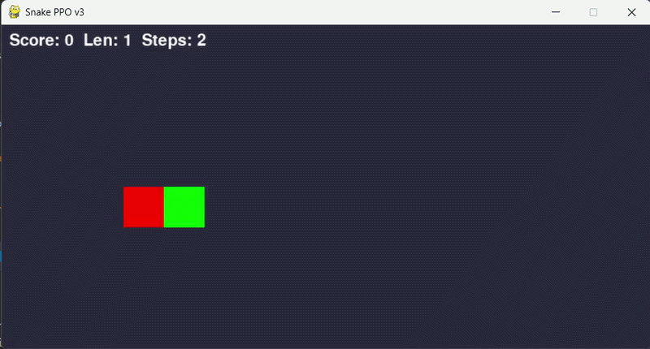
</p>

## 📖 Project Description

This project is the **third installment** of my Snake AI series :

- 🎮 The Snake game itself : [snake_game](https://github.com/Thibault-GAREL/snake_game)
- 🧬 First AI version using NEAT (NeuroEvolution) : [AI_snake_genetic_version](https://github.com/Thibault-GAREL/AI_snake_genetic_version)
- 🤖 Second AI version using DQN : [AI_snake_DQL](https://github.com/Thibault-GAREL/AI_snake_DQL)

This time, the agent learns to play Snake using **Proximal Policy Optimization (PPO)** with PyTorch and CUDA support. Unlike DQN which learns Q-values off-policy from a replay buffer, PPO is an **on-policy actor-critic** algorithm : it collects rollouts, estimates advantages via GAE, and updates both a policy (actor) and a value function (critic) jointly, with a clipped surrogate objective to prevent destructive updates. 🤖🎯

The project also includes a full **Explainable AI (XAI)** suite adapted for the actor-critic architecture, analyzing what the network has learned beyond raw performance metrics.

---

## 🆚 Comparison — 4 Snake AI approaches

This project is part of a series of **4 Snake AI implementations** using different AI paradigms on the same game :

| Aspect | 🧬 [NEAT](https://github.com/Thibault-GAREL/AI_snake_genetic_version) | 🤖 [DQL (DQN)](https://github.com/Thibault-GAREL/AI_snake_DQL) | 🎯 [PPO](https://github.com/Thibault-GAREL/snake_PPO_V2) ★ | 🌳 [Decision Tree](https://github.com/Thibault-GAREL/AI_snake_decision_tree_version) |
| --- | --- | --- | --- | --- |
| **Paradigm** | Evolutionary | Reinforcement Learning | Reinforcement Learning | Imitation Learning |
| **Algorithm type** | Neuroevolution | Off-policy (Q-learning) | On-policy (Actor-Critic) | Supervised (XGBoost + DAgger) |
| **Output** | Actions [4] | Q-values [4] | Policy logits [4] + V(s) [1] | Class probabilities [4] |
| **Input features** | 16 | 16 | 28 | 26 |
| **Architecture** | Evolving MLP (topology changes) | MLP 16→256→128→64→4 | Actor-Critic shared trunk 28→256→256 | 1 600 boosted trees (400 × 4 classes) |
| **Hidden neurons / nodes** | ~28 nodes (evolves) | 448 hidden neurons | 896 hidden neurons | ~80k–200k decision nodes |
| **Exploration** | Genetic mutations + speciation | ε-greedy (1.0 → 0.01) | Entropy bonus (coef 0.05) | DAgger oracle (β : 0.8 → 0.05) |
| **Memory / Buffer** | Population (100 genomes) | Experience Replay (100 000) | Rollout buffer (2 048 steps) | Supervised buffer (300 000) |
| **Batch** | — (full population eval.) | 128 | 64 | Full dataset per round |
| **Training time** | ~15 h | ~30–60 min (GPU) | ~3 h (GPU) | ~12 min (GPU) |
| **Max score** | > 20 | 13 | **64** | **43** |
| **Mean score** | 10 | 8.55 | **38.67** | **22.77** |
| **Reward signal** | ❌ (fitness only) | ✅ | ✅ | ❌ (oracle labels) |
| **GPU support** | ❌ | ✅ | ✅ | ✅ |
| **Sample efficiency** | 🔴 Low | 🟡 Medium | 🔴 Low | 🟢 High |
| **Intrinsic interpretability** | 🟡 Low | 🔴 Black box | 🔴 Black box | 🟢 High (tree paths) |
| **XAI suite** | ✅ 4 scripts | ✅ 4 scripts | ✅ 4 scripts | ✅ 4 scripts |

> ★ = current repository

---

## ✨ Features

🧠 **Actor-Critic architecture** — shared trunk with separate policy and value heads

⚡ **CUDA support** — automatic GPU detection and training

📐 **Generalized Advantage Estimation (GAE)** — λ=0.95 for stable advantage computation

✂️ **PPO Clipping** — ε=0.15 for conservative policy updates

🔄 **CosineAnnealing LR** — smooth decay from 3e-4 to 1e-5 over full training

💾 **Auto-save** — best model checkpoint based on 50-episode rolling mean score

📊 **CSV training log** — episode, score, entropy, LR, losses tracked every episode

📊 **Full XAI suite** — 4 independent analysis scripts adapted for actor-critic

📐 **Unified 28-feature state** — shared across all 4 Snake AI projects (see [input.md](input.md))

---

## ⚙️ How it works

🕹️ The AI controls a snake on a **16×8 grid** (800×400 px). At each step, it receives a **unified state vector of 28 features** (see [input.md](input.md)) and outputs **policy logits for 4 actions** (UP, RIGHT, DOWN, LEFT) along with a **state value estimate**.

🧠 The network is a shared-trunk MLP (28 → 256 → 256) split into an actor head (→ 128 → 4 logits) and a critic head (→ 128 → 1 value), trained with the PPO-Clip algorithm. Advantages are estimated via GAE from the rollout buffer.

🎁 The reward shaping guides the agent with a survival bonus (+0.02/step), a **potential-based proximity reward** (proportional to the reduction in Manhattan distance to food), a food reward (+10), a death penalty (−10 − length×0.5), and a stagnation penalty (−0.5 if steps without food > MAX_STEPS − length×2).

---

## 🗺️ Network Architecture

```
Input (28)
    │
    ├─ Linear(28 → 256) ─ LayerNorm ─ Tanh   ┐
    └─ Linear(256 → 256) ─ LayerNorm ─ Tanh  ┘ Shared trunk
              │                    │
    ┌─────────┘                    └──────────┐
    │ Actor head                   Critic head │
    │ Linear(256 → 128) ─ Tanh                │ Linear(256 → 128) ─ Tanh
    │ Linear(128 → 4)                         │ Linear(128 → 1)
    ↓                                         ↓
  Policy logits [4]                      State value [1]
  → softmax → P(action)                  → V(s)
```

<details>
<summary>📋 Unified state vector — 28 input features (see input.md)</summary>

### Group 1 — Danger distances (8 inputs)

Distance to nearest obstacle (wall or body) in 8 directions, normalized by `sqrt(WIDTH² + HEIGHT²)` → [0, 1].

| #   | Feature                                                     |
| --- | ----------------------------------------------------------- |
| 0   | `distance_danger_N` — Distance to nearest obstacle North    |
| 1   | `distance_danger_NE` — Distance to nearest obstacle NE      |
| 2   | `distance_danger_E` — Distance to nearest obstacle East     |
| 3   | `distance_danger_SE` — Distance to nearest obstacle SE      |
| 4   | `distance_danger_S` — Distance to nearest obstacle South    |
| 5   | `distance_danger_SW` — Distance to nearest obstacle SW      |
| 6   | `distance_danger_W` — Distance to nearest obstacle West     |
| 7   | `distance_danger_NW` — Distance to nearest obstacle NW      |

### Group 2 — Food distances, sparse (8 inputs)

Distance to food in 8 directions. **Sparse** : non-zero only when food is exactly aligned. Normalized by `max_dist`.

| #   | Feature                                              |
| --- | ---------------------------------------------------- |
| 8   | `distance_food_N` — Distance to food if aligned N    |
| 9   | `distance_food_NE` — Distance to food if aligned NE  |
| 10  | `distance_food_E` — Distance to food if aligned E    |
| 11  | `distance_food_SE` — Distance to food if aligned SE  |
| 12  | `distance_food_S` — Distance to food if aligned S    |
| 13  | `distance_food_SW` — Distance to food if aligned SW  |
| 14  | `distance_food_W` — Distance to food if aligned W    |
| 15  | `distance_food_NW` — Distance to food if aligned NW  |

### Group 3 — Food direction, continuous (2 inputs)

**Always non-zero** — solves the blind spot of sparse features [8:15] which are zero ~80% of the time.

| #   | Feature                                                          |
| --- | ---------------------------------------------------------------- |
| 16  | `food_delta_x` — (food.x − head.x) / WIDTH, range [−1, 1]      |
| 17  | `food_delta_y` — (food.y − head.y) / HEIGHT, range [−1, 1]     |

### Group 4 — Immediate danger, binary (4 inputs)

**Absolute** (N/E/S/W), not relative to the snake's direction. 1.0 if wall or body 1 cell away.

| #   | Feature                                     |
| --- | ------------------------------------------- |
| 18  | `danger_N` — Obstacle 1 cell North          |
| 19  | `danger_E` — Obstacle 1 cell East           |
| 20  | `danger_S` — Obstacle 1 cell South          |
| 21  | `danger_W` — Obstacle 1 cell West           |

### Group 5 — Direction one-hot (4 inputs)

| #   | Feature                                       |
| --- | --------------------------------------------- |
| 22  | `dir_UP` — 1 if current direction is UP       |
| 23  | `dir_RIGHT` — 1 if current direction is RIGHT |
| 24  | `dir_DOWN` — 1 if current direction is DOWN   |
| 25  | `dir_LEFT` — 1 if current direction is LEFT   |

### Group 6 — Temporal context (2 inputs)

| #   | Feature                                                                             |
| --- | ----------------------------------------------------------------------------------- |
| 26  | `length_norm` — Snake length normalized : (length−1) / (MAX_CELLS−1), range [0, 1] |
| 27  | `urgency` — Steps since last food / MAX_STEPS, range [0, 1]                        |

### Output — 4 actions

| #   | Action  |
| --- | ------- |
| 0   | `UP`    |
| 1   | `RIGHT` |
| 2   | `DOWN`  |
| 3   | `LEFT`  |

</details>

---

## 🔬 Explainable AI (XAI) Suite

Four dedicated scripts analyze the PPO actor-critic model from different angles, adapted from the DQN XAI suite to handle the new architecture (Tanh activations, 28 features, policy probabilities instead of Q-values) :

| Script                   | Analysis                                                                               | Output                 |
| ------------------------ | -------------------------------------------------------------------------------------- | ---------------------- |
| `xai_qvalues_ppo.py`     | Policy probability heatmaps, confidence map, temporal evolution of P(action) + V(s)    | `xai_qvalues_ppo/`     |
| `xai_features_ppo.py`    | Permutation importance, weight variance (W₁ 22→256), feature-action correlation        | `xai_features_ppo/`    |
| `xai_activations_ppo.py` | Tanh saturation, neuron specialization, t-SNE / UMAP of 4 layers                       | `xai_activations_ppo/` |
| `xai_shap_ppo.py`        | SHAP DeepExplainer on ActorWrapper — beeswarm, waterfall, force plots, summary heatmap | `xai_shap_ppo/`        |

> **Note on XAI adaptations vs DQN :**
>
> - **No dead neurons** : Tanh never outputs exactly 0. Replaced by _saturation_ analysis (|act| > 0.99)
> - **No Q-values** : replaced by `softmax(logits)` → policy probabilities P(action) and critic value V(s)
> - **28 features** split into 6 groups : 🔵 danger distances / 🟠 food sparse / 🟡 food delta / 🔴 danger binary / 🟢 direction / 🩷 context
> - **SHAP** : wrapped in `ActorWrapper` to expose only the actor logits to `DeepExplainer`

<details>
<summary>📸 See the XAI analyses — results & interpretation</summary>

---

### 🖼️ Policy heatmaps (`xai_qvalues_ppo.py`)

#### Policy probability heatmaps + State value

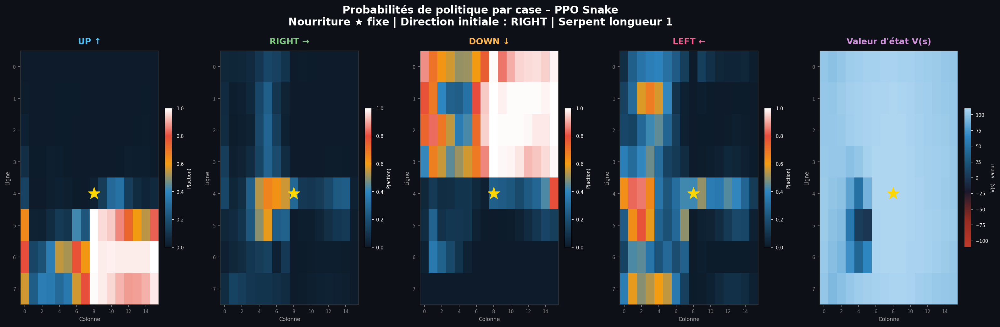

_5 heatmaps : P(UP), P(RIGHT), P(DOWN), P(LEFT) and V(s). Food position fixed (★). Each cell shows the policy probability for that action when the snake head is at that position. Warm colors = the agent strongly prefers that action from that cell. The value heatmap V(s) shows which areas the agent considers most promising._

#### Confidence map & learned policy

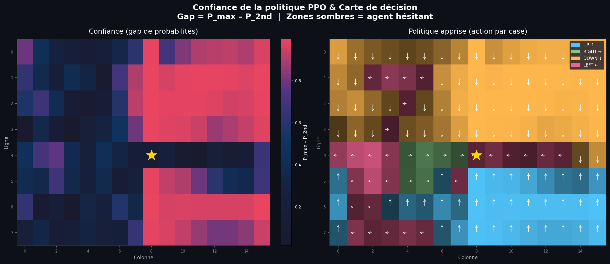

_Left : gap between top-1 and top-2 probabilities — dark cells = the agent hesitates between two actions. Right : dominant action per cell with directional arrows, brightness weighted by confidence._

#### Temporal evolution

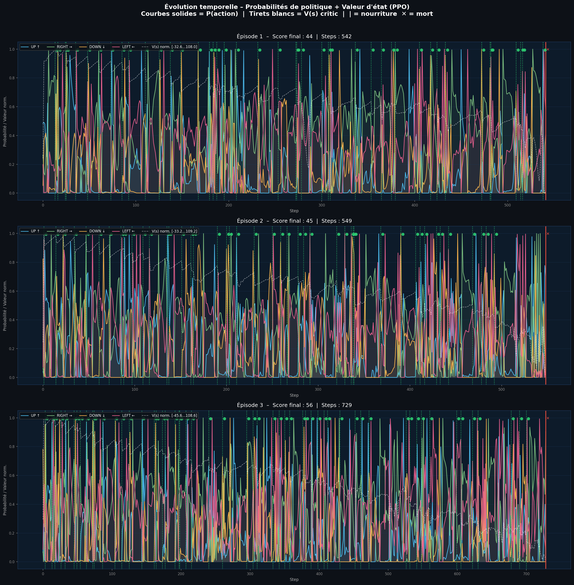

_Policy probabilities for all 4 actions over time (solid curves, sum ≈ 1). Dashed white = V(s) normalized. Green markers = food eaten, red markers = death._

---

### 🖼️ Feature importance (`xai_features_ppo.py`)

#### Permutation importance

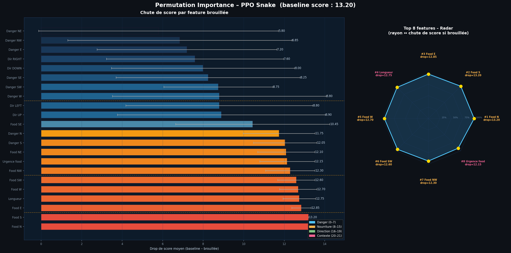

_Score drop when each of the 22 features is randomized. Features with longer bars are critical for performance. Radar chart shows the top-8 most important features._

#### Weight variance (W₁ analysis)

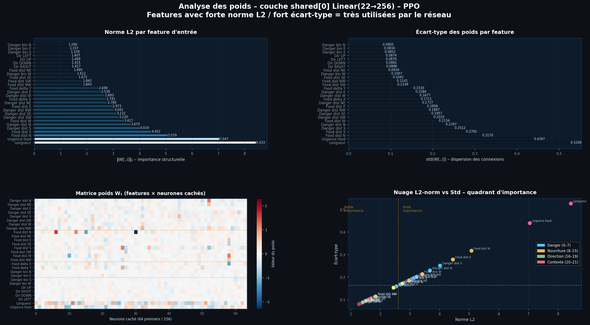

_L2 norm and std of each input column in shared[0] Linear(22→256). Features with high L2 norm are structurally important. Heatmap shows the full weight matrix W₁ [22×64 neurons]. Scatter plot reveals the importance quadrant._

#### Feature-action correlation

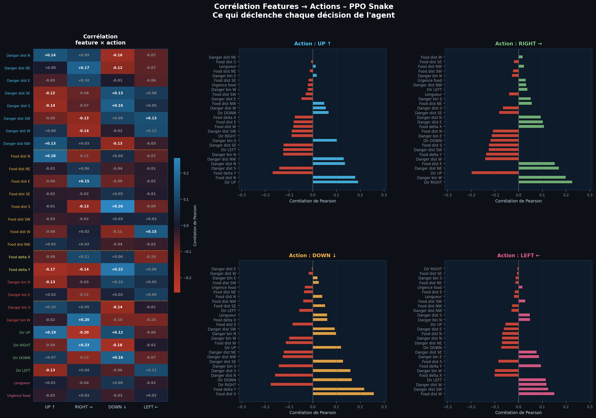

_Pearson correlation between each feature and each chosen action. Clean patterns confirm the agent uses food direction features to trigger corresponding movements and wall features to avoid obstacles._

#### Sensory profile per action

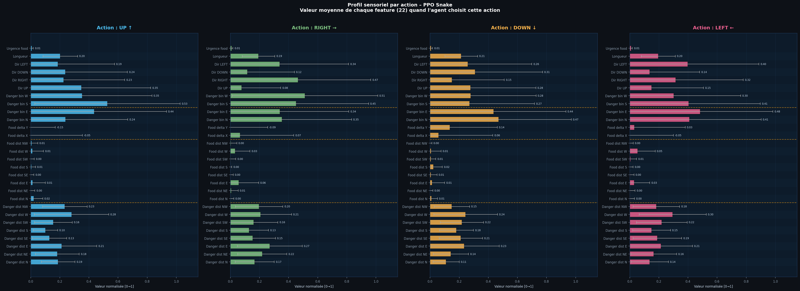

_Mean value of all 22 features when the agent chooses each action. Color-coded by category : 🔵 danger, 🟠 food, 🟢 direction, 🩷 context._

---

### 🖼️ Internal activations (`xai_activations_ppo.py`)

#### Distribution & saturation

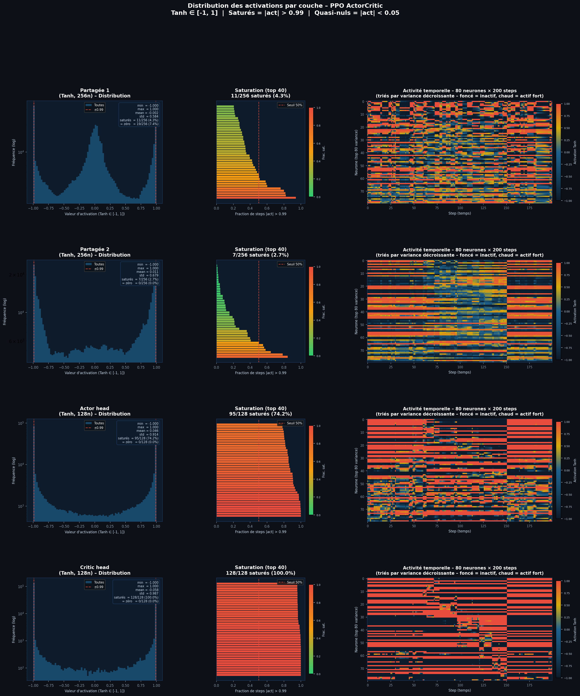

_Activation distributions for the 4 Tanh layers (shared×2, actor, critic). Unlike ReLU, Tanh never produces exactly 0 — instead we track saturation (|act| > 0.99) and near-zero (|act| < 0.05) neuron rates. Temporal heatmaps show activity over 200 steps sorted by variance._

#### Neuron specialization

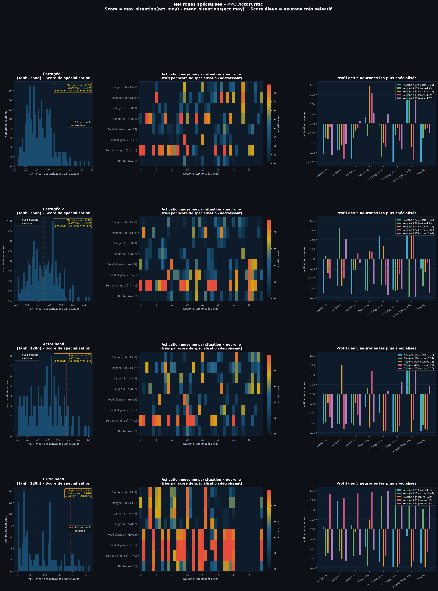

_Specialization score = max_situation(mean_activation) − mean_all_situations. High score = neuron dedicated to a specific game context (danger, food alignment, long snake…). Top-5 most specialized neurons profiled per layer._

#### t-SNE projection

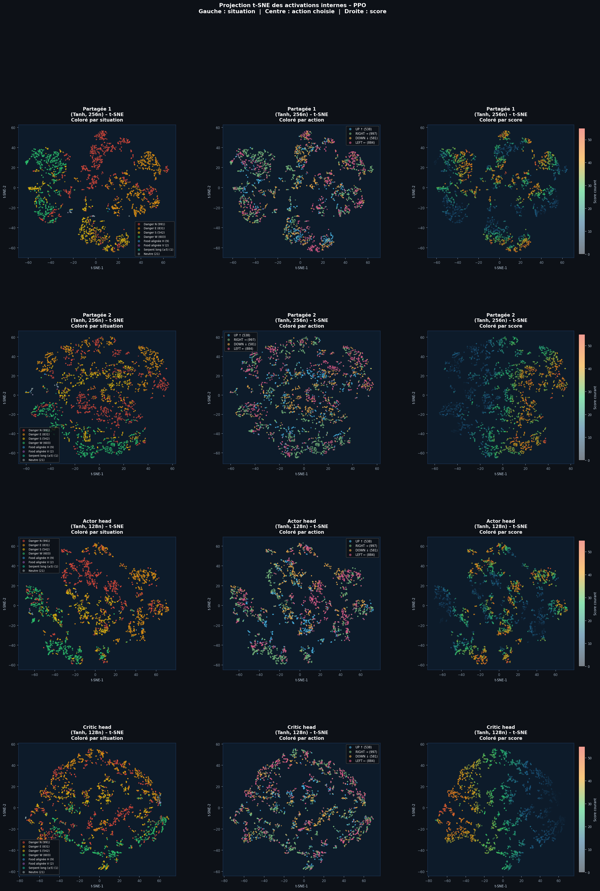

_2D projection of internal activations for 4 layers. Points colored by game situation (left), chosen action (center), and current score (right). Clusters reveal how the network organizes its internal representations._

---

### 🖼️ SHAP analysis (`xai_shap_ppo.py`)

#### Beeswarm plot

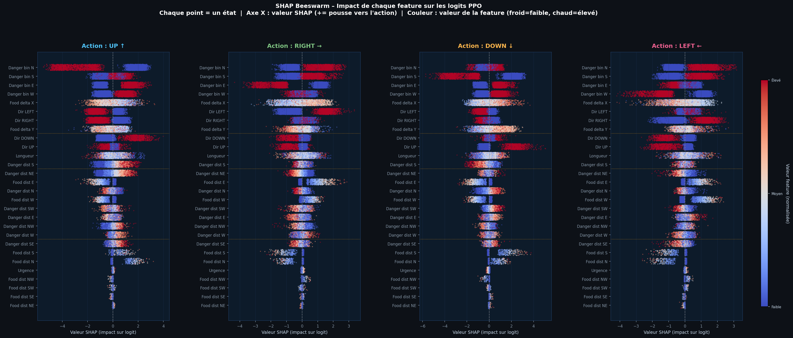

_Each point = one game state. X-axis = SHAP value (positive = pushes toward this action). Color = feature value (cold=low, warm=high). Features sorted by mean |SHAP| — most impactful at top._

#### Waterfall plots

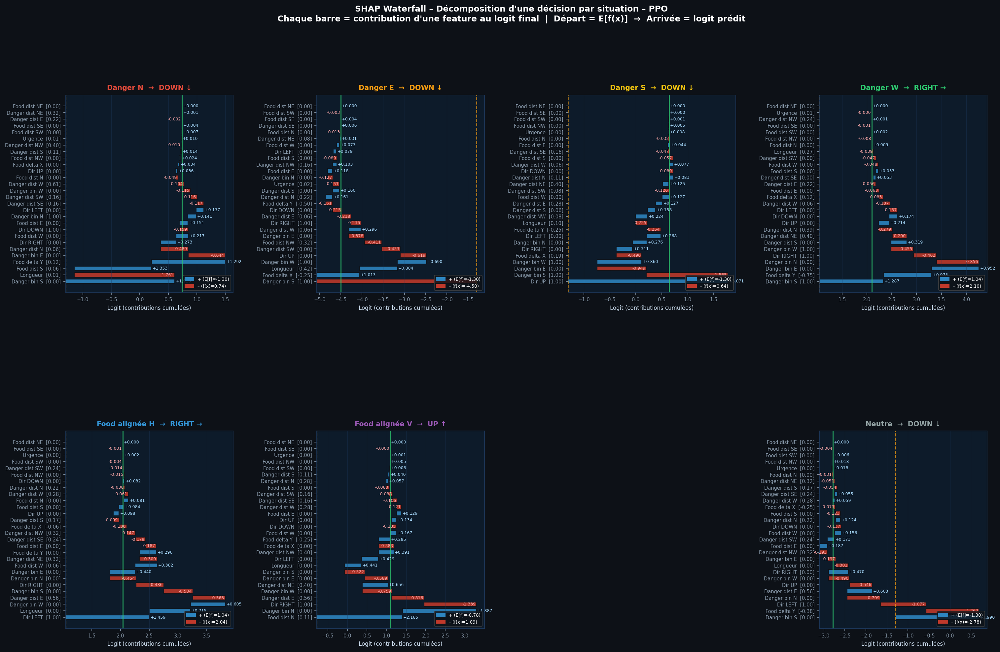

_One waterfall per game situation. Starts from E[f(x)] (baseline logit), accumulates feature contributions to reach the predicted logit f(x). Blue = positive contribution, red = negative._

#### SHAP summary heatmap

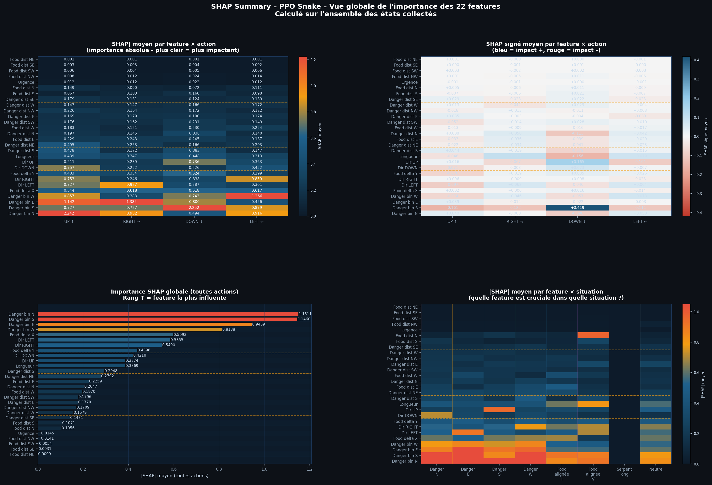

_4 views : |SHAP|×action (absolute importance), signed SHAP×action (direction of influence), global importance barplot ranking all 22 features, and |SHAP|×situation (which feature matters most in which context)._

</details>

---

## 📁 Repository structure

```bash
├── snake.py                    # Snake game engine (from snake_game repo)
├── PPO.py                      # PPO agent, ActorCritic network, SnakeEnv
├── main.py                     # Training loop + evaluation CLI
│
├── xai_qvalues_ppo.py          # XAI — Policy probability + value analysis
├── xai_features_ppo.py         # XAI — Feature importance (22 features)
├── xai_activations_ppo.py      # XAI — Internal activations (Tanh layers)
├── xai_shap_ppo.py             # XAI — SHAP explanations (ActorWrapper)
│
├── input.md                    # Unified 28-feature state specification
├── model_best.pth              # Best model checkpoint (rolling mean 50 ep.)
├── model_last.pth              # Final model checkpoint
├── training_log.csv            # Per-episode training metrics
│
├── xai_qvalues_ppo/            # Output plots — Policy & Value
├── xai_features_ppo/           # Output plots — Feature importance
├── xai_activations_ppo/        # Output plots — Activations
├── xai_shap_ppo/               # Output plots + HTML — SHAP
│
├── LICENSE
└── README.md
```

---

## 💻 Run it on Your PC

Clone the repository and install dependencies :

```bash
git clone https://github.com/Thibault-GAREL/snake_PPO_V2.git
cd snake_PPO_V2

python -m venv .venv
source .venv/bin/activate       # Linux / macOS
.venv\Scripts\activate          # Windows

pip install torch torchvision --index-url https://download.pytorch.org/whl/cu118
pip install pygame numpy matplotlib scipy scikit-learn
pip install shap                # for xai_shap_ppo.py
pip install umap-learn          # optional, for xai_activations_ppo.py --umap
```

### Train the agent

```bash
python main.py                        # silent training (5M timesteps)
python main.py --show-every 100       # render every 100 episodes
python main.py --load                 # resume from model_best.pth
python main.py --timesteps 2000000    # custom timestep budget
python main.py --device cpu           # force CPU
```

### Evaluate a trained model

```bash
python main.py --eval                 # greedy evaluation, visual (20 episodes)
python main.py --eval --eval-episodes 50
```

### Run XAI analyses

```bash
# Policy heatmaps & confidence map
python xai_qvalues_ppo.py                         # all plots
python xai_qvalues_ppo.py --heatmap               # policy + value heatmaps only
python xai_qvalues_ppo.py --temporal --episodes 3 # temporal evolution

# Feature importance (22 features)
python xai_features_ppo.py --variance             # fast, no episodes needed
python xai_features_ppo.py --correlation --episodes 20
python xai_features_ppo.py --permutation --episodes 30

# Internal activations (4 Tanh layers)
python xai_activations_ppo.py --distribution --episodes 5
python xai_activations_ppo.py --specialization --episodes 10
python xai_activations_ppo.py --tsne --episodes 15

# SHAP explanations (requires: pip install shap)
python xai_shap_ppo.py --heatmap --episodes 5 --background 50   # fast test
python xai_shap_ppo.py --beeswarm --episodes 12
python xai_shap_ppo.py                                           # all plots
```

---

## ⚙️ Key Hyperparameters

| Parameter         | Value           | Description                                              |
| ----------------- | --------------- | -------------------------------------------------------- |
| `LR`              | 3e-4            | Adam optimizer initial learning rate                     |
| `LR schedule`     | CosineAnnealing | Decay from 3e-4 to 1e-5 over full training               |
| `GAMMA`           | 0.99            | Discount factor (long horizon)                           |
| `GAE_LAMBDA`      | 0.95            | GAE smoothing parameter                                  |
| `CLIP_EPS`        | 0.15            | PPO surrogate clipping range (conservative updates)      |
| `ENT_COEF`        | 0.05            | Entropy bonus — crucial for long-snake exploration       |
| `VF_COEF`         | 0.5             | Value function loss coefficient                          |
| `MAX_GRAD`        | 0.5             | Gradient clipping norm                                   |
| `N_EPOCHS`        | 10              | PPO epochs per update                                    |
| `BATCH_SIZE`      | 256             | Mini-batch size per gradient step (stable gradients)     |
| `N_STEPS`         | 1024            | Rollout steps per env before update (better GAE)         |
| `N_ENVS`          | 8               | Parallel environments (8192 steps/collect total)         |
| `MAX_STEPS`       | 1000            | Max episode length (allows eating 23+ foods)             |
| `total_timesteps` | 15 000 000      | Training budget                                          |
| `hidden_size`     | 256             | Neurons in shared trunk layers                           |

---

## 📈 Reward Shaping

| Event                | Reward                                                              |
| -------------------- | ------------------------------------------------------------------- |
| Survival (each step) | +0.02                                                               |
| Food proximity       | +0.1 × (prev_manhattan − new_manhattan) / CELL *(potential-based)* |
| Food eaten           | +10.0                                                               |
| Win (grid full)      | +20.0                                                               |
| Death (wall or body) | −10.0 − length × 0.5                                               |
| Stagnation penalty   | −0.5 if `steps_since_food > max(100, 300 − length×5)` *(adaptive)* |

The death penalty scales with snake length : losing a long snake is penalized more than losing a short one. The potential-based proximity reward provides dense feedback at every step — it cannot distort the optimal policy since it is grounded in a potential function (Manhattan distance to food).

---

## 📚 Inspiration / Sources

Built entirely from scratch 🛠️ !

Code created by me 😊, Thibault GAREL — [Github](https://github.com/Thibault-GAREL)
